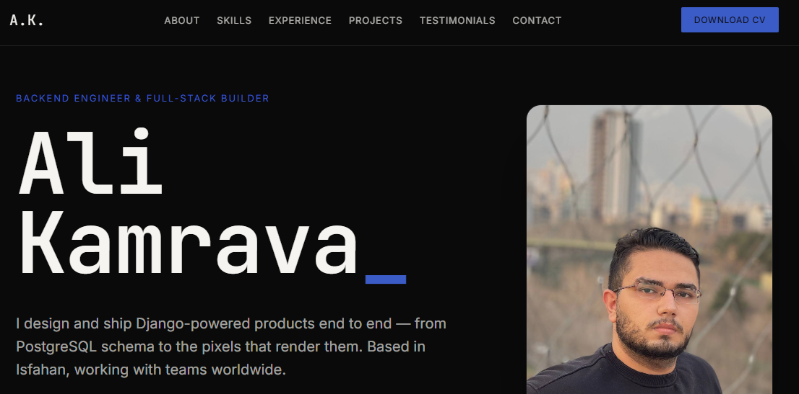
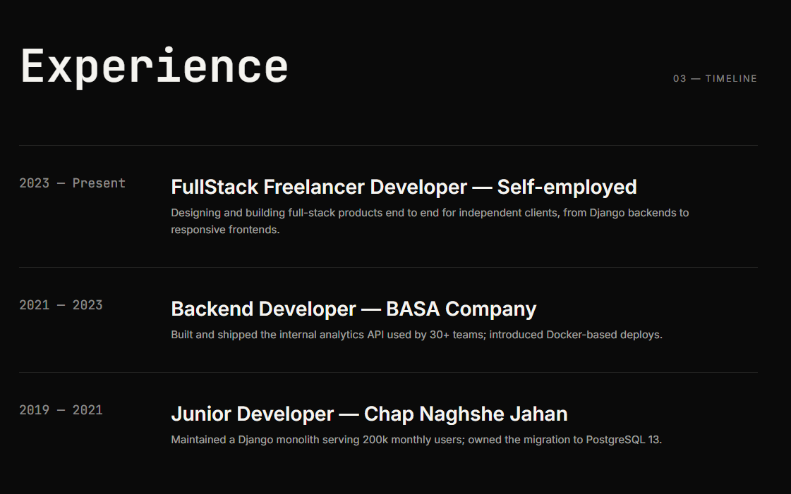
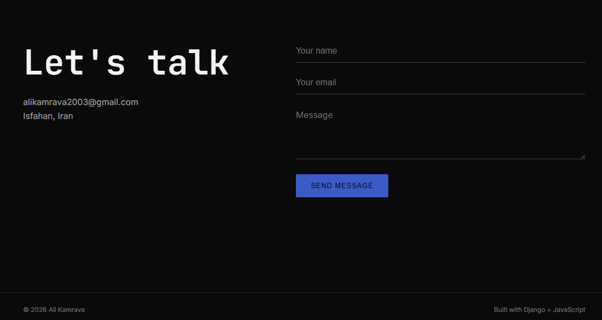

# Ali Kamrava — Portfolio

A personal CV/portfolio site: a Django REST API backed by PostgreSQL, and a static
frontend that fetches from it. Same origin in both development and production, so
there is no API base URL to configure and no CORS in the way.







## Stack

- Django 6 + Django REST Framework
- PostgreSQL (psycopg 3)
- Static frontend — plain HTML/CSS/JS, no build step
- gunicorn + nginx in production

## API

All content lives in the database and is editable from `/admin/`.

| Method | Endpoint | Returns |
|---|---|---|
| `GET` | `/api/resume/` | profile, skills, projects, experience, testimonials — one round trip |
| `GET` | `/api/projects/<slug>/` | a single project |
| `POST` | `/api/contact/` | `201` on success, `400` with field errors |

## Running locally

```bash
cd cv-portfolio
python -m venv venv
venv\Scripts\activate            # Linux/macOS: source venv/bin/activate
pip install -r requirements.txt

cp .env.example .env             # fill in DEBUG=True, SECRET_KEY, database creds
python manage.py migrate
python manage.py createsuperuser
python manage.py runserver
```

Open <http://127.0.0.1:8000/>. With `DEBUG=True` Django serves the frontend,
its assets, and uploaded media itself, so this is the only process you need.

## Tests

```bash
python manage.py test portfolio --settings=config.settings_test
```

The override runs the suite on in-memory sqlite, so it needs no `CREATEDB`
grant on postgres.

## Deployment

nginx serves the frontend, static files, and media straight off disk; it
proxies only `/api/` and `/admin/` to gunicorn over a unix socket. With
`DEBUG=False`, Django serves nothing else — see [config/urls.py](config/urls.py).

Ready-to-use configs are in [deploy/](deploy/):

- [`portfolio.service`](deploy/portfolio.service) — systemd unit for gunicorn
- [`nginx.conf`](deploy/nginx.conf) — server block

```bash
sudo cp deploy/portfolio.service /etc/systemd/system/
sudo systemctl enable --now portfolio

sudo cp deploy/nginx.conf /etc/nginx/sites-available/portfolio
sudo ln -s /etc/nginx/sites-available/portfolio /etc/nginx/sites-enabled/
sudo nginx -t && sudo systemctl reload nginx

sudo certbot --nginx -d yourdomain.com
```

Redeploys:

```bash
git pull && pip install -r requirements.txt
python manage.py migrate && python manage.py collectstatic --noinput
sudo systemctl restart portfolio
```

Frontend-only changes need no restart.

## Layout

```
cv-portfolio/
├── config/        settings, urls, wsgi
├── portfolio/     models, serializers, views, tests
├── frontend/      index.html + assets (served by nginx in prod)
├── deploy/        systemd unit + nginx server block
├── media/         user uploads (gitignored)
└── staticfiles/   collectstatic output (gitignored)
```
